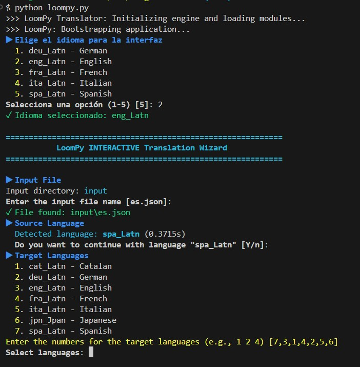
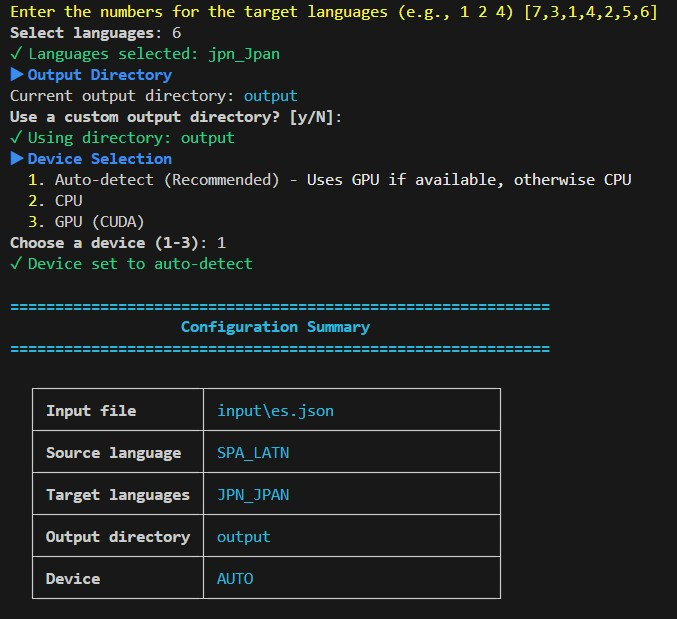
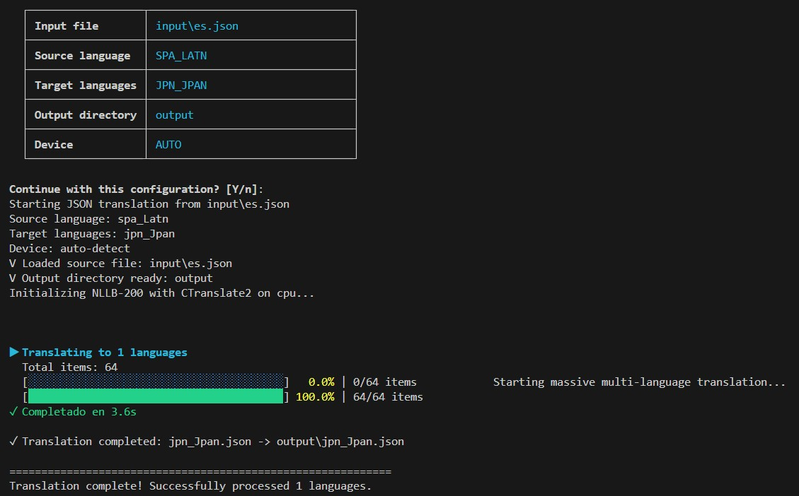

# 🌐 LoomPy v2

<div align="center">
  
  <p><i>"I am Bobbin Threadbare, and I have come to join the Guild of Weavers."</i></p>
</div>


LoomPy v2 is a high-performance command-line translator designed for developers. It translates JSON files between **200+ languages** while preserving exact structure, keys, and complex placeholders. Powered by **Meta's NLLB-200** and optimized with **CTranslate2 (INT8)**.

## ✨ Key Features

- **🚀 Ultra-Fast Engine**: Optimized with CTranslate2 for **>60% performance improvement** on any hardware.
- **🌍 200+ Languages**: Full support for FLORES-200 codes (Catalan, Galician, Asturian, Japanese, Korean, etc.).
- **🧹 Identity Translation**: Translate a file to its own language to **auto-sort keys** and **remove duplicates**.
- **🎯 Smart Detection**: Automatic source language detection with interactive FLORES-200 confirmation.
- **🛡️ Placeholder Protection**: Native support for `{braces}`, `%s`, `%(named)s`, and more.
- **💻 Modern CLI**: Simplified interactive wizard with localized interface (ES, EN, FR).
- **🔋 Hardware Optimized**: Automatic GPU detection with INT8 quantization for blazing-fast CPU inference.

## 📸 Screenshots

<div align="center">
  
  <br>
  <hr>
  <br>
  
  <br>
  <hr>
  <br>
  
</div>

## 🚀 Quick Start

### 1. Installation

```bash
# Clone the repository
git clone https://github.com/alvaromorenomorales/LoomPy.git
cd LoomPy

# Install dependencies
pip install -r requirements.txt
```

### 2. Install & Optimize Model (Required once)
LoomPy uses a local, optimized version of NLLB-200 for maximum privacy and speed.

```bash
python -m src.install_model
```

### 3. Run Interactive Mode
The easiest way to start is the interactive wizard:

```bash
python loompy.py
```

## 🛠️ Usage

### Command Line Interface

```bash
# Basic usage (defaults to config.json settings)
python loompy.py input/es.json

# Fully customized
python loompy.py input/es.json --source-lang spa_Latn --langs eng_Latn fra_Latn deu_Latn --out-dir ./output
```

### Parameters
| Flag | Description |
| --- | --- |
| `--interactive` | Force the interactive wizard (default if no args) |
| `--source-lang` | Source FLORES-200 code (e.g., `spa_Latn`) |
| `--langs` | List of target FLORES-200 codes |
| `--out-dir` | Output directory (created automatically) |
| `--device` | Force `cpu` or `cuda` (default: `auto`) |

## 📦 Workflow: Clean & Sort
LoomPy v2 can be used as a **JSON Normalizer**. Simply translate a file to its own language to get a perfectly sorted version without duplicates.

**Example:**
```bash
python loompy.py input/es.json --langs spa_Latn
```
*Result: `output/spa_Latn.json` with all keys alphabetically sorted and duplicates merged.*

## ⚙️ Configuration
Customize your default behavior in `config.json`:

```json
{
  "default_source_language": "spa_Latn",
  "default_target_languages": [
    "eng_Latn", 
    "fra_Latn",
    "cat_Latn"
  ]
}
```

## 🧩 Supported Placeholders
LoomPy preserves your code variables automatically:
- **Braces**: `Hello {name}`
- **Printf**: `Found %d items`
- **Named Printf**: `User %(username)s is active`
- **Positional**: `Order %1$s from %2$s`

## 📚 Supported Languages
For a full list of the 200+ supported codes and their display names, see [SUPPORTED_LANGUAGES.md](./SUPPORTED_LANGUAGES.md).

## 🧪 Testing
Run the complete test suite (89 tests):

```bash
python -m pytest src/tests
```

---

## 📜 License
Licensed under the MIT License - see the [LICENSE](LICENSE) file for details.

## 🙏 Acknowledgments
- **Meta NLLB-200**: For the state-of-the-art multilingual model.
- **OpenNMT CTranslate2**: For the high-performance inference engine.
- **Hugging Face**: For the amazing Transformers ecosystem.
